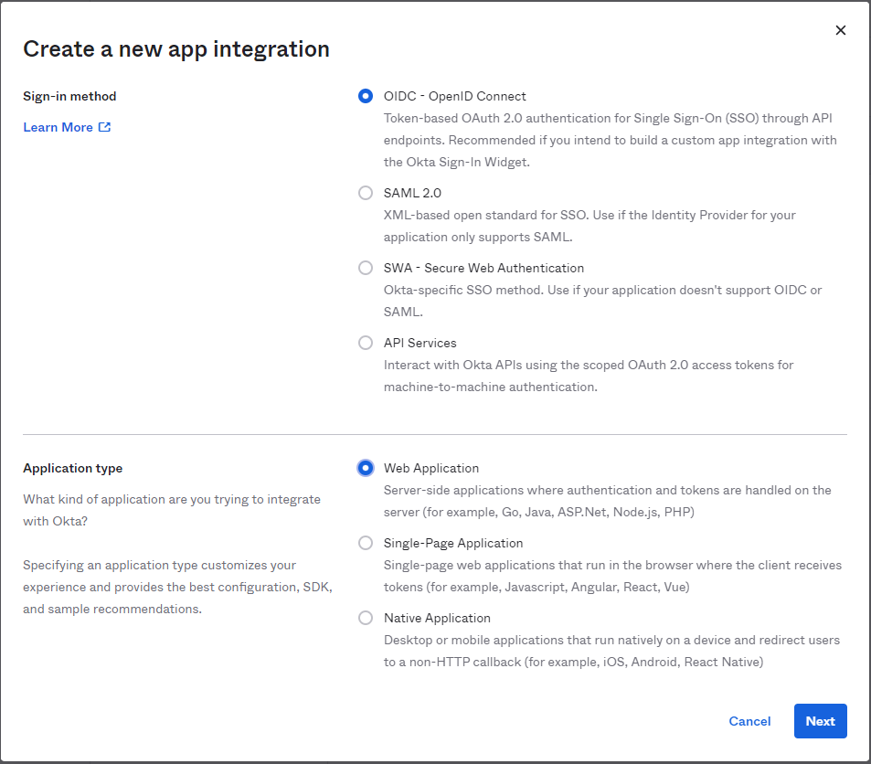
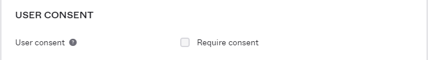
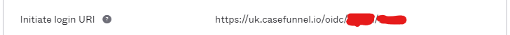

# Configuring Okta for SSO
Before beginning the setup you will need the following information from FinLegal. Please speak to your account manager who can supply this information:
* Sign-in redirect URI
* Initiate login URI

## Step 1: Creating A New App Integration in Okta
1. Sign in to your Okta Admin Dashboard and navigate to `Applications`.
2. Click `Create App Integration`.
3. Select `OIDC - Open Connect` as the sign in method and `Web Application` as the application type.  

4. Complete the following `New Web App Integration` and click `Save`.

Setting | Detail
---|---
App integration name | Set to `Claims Automation by Finlegal`
Grant type | Leave as default, that is `Client Credentials`, `Refresh Token`, & `Implicit (hybrid)` should not be ticked and `Authorization Code` should be ticked.
Sign-in redirect URIs | Please speak to your account manager for this value.
Sign-out redirect URIs | Clear any value here by clicking .  We do not currently support redirecting the user after signing out of Claims Automation.
Controlled access | Set to `Skip group assignment for now`. This should be configured in accordance with your access policy to determine who should be able to login to Claims Automation.

5. Under the `General Settings` section ensure `User consent` is not checked. If it is click `Edit`, uncheck `Require consent` and `Save`.  

6. Now we need you to share the following with your account manager. Please ensure all information is shared using a secure and reliable method.

Setting | Detail
---|---
Client ID | Locate the `Client Credentials` section in the `General` tab on the application configuration page (`Applications > Claims Automation by Finlegal`). Client ID should be found there, please copy and send across securely.
Client Secret | In the same `Client Credentials` section locate the `Client Secrets` list. There should be at least one secret listed, usually masked. Please copy and send across securely.
Authorization Server Metadata URI | This can be found `Security > API > Authorization Servers (tab)`. Click on the authorisation server that is to be used. Under the `Settings` tab you will find the Metadata URI. Either send the contents of the link or the link itself, it should be accessible anonymously.

## Step 2: Finlegal Setup
Once we have received the information listed in the previous step we will configure SSO against your account.

We will then send you the url your users will use to initiate the login for SSO. Please follow the next step to add this to complete your SSO configuration.

## Step 3: Adding The Initiate Login URI
1. Locate the `Claims Automation by Finlegal` application and click to view the settings.
2. Click `Edit` in the `General Settings` section.
3. Now complete the following and click `Save`.

Setting | Detail
---|---
Initiate login URI | Please speak to your account manager for this value.

Example:
 

## Step 4: Testing SSO
Direct your users to follow the Initiate Login URI. They may, or may not, be asked to authenticate by Okta after which they will be redirected to Claims Automation as per the example below.

https://user-images.githubusercontent.com/1143865/225955073-16c93495-a1cc-49bc-b982-129a4d086e58.mp4

## FAQ
TBC
