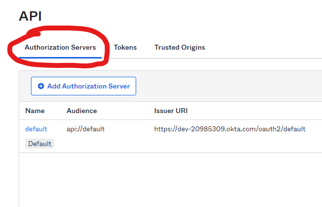

# Single Sign-On for Claims Automation (formerly Casefunnel)
Single sign-on (SSO) enables users to login to Claims Automation using your organisation's preferred identity provider. We support any provider that supports the OpenID Connect protocol. This includes, but not limited to, Azure AD & Okta.

Once configured correctly we will provide you with an initiate login URI. This will be used by your users and will trigger the authentication flow.

## How-to configure Okta for SSO
**Note:** Before proceeding please ensure you have API access management enabled on your account. This is enabled if you can access the following menu in your Okta Admin Dashboard: `Security > API > Authorization Servers (tab)`.

[Follow our guide](Okta/Okta.md)

## How-to configure Azure AD for SSO
TBC

